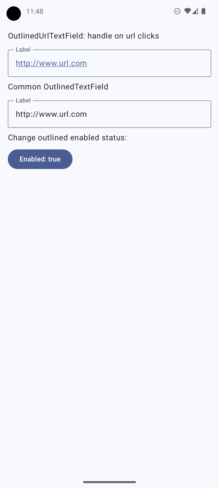
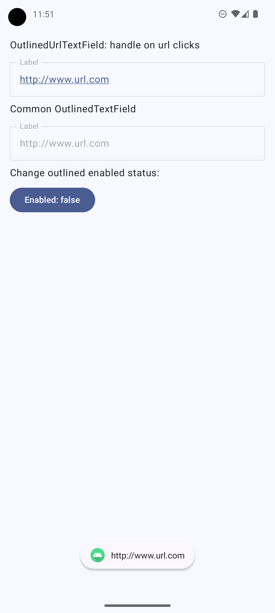

# **OutlinedUrlTextField vs Common OutlinedTextField in Jetpack Compose**

This project demonstrates how to implement an **OutlinedUrlTextField** in Jetpack Compose and
compares it with a standard **OutlinedTextField**. The goal is to highlight the differences and
benefits of using a specialized URL input field in Android apps.

## **Features**

- 📌 **OutlinedUrlTextField**: A custom text field optimized for URL input.
- 📝 **OutlinedTextField**: The default text field for general text input.
- 🔍 **Comparison**: See the differences in behavior, input validation, and user experience.
- 🎨 **Material 3 Design**: Uses Material Design components for a modern UI.

## **Implementation**

### **1️⃣ Standard OutlinedTextField**

```kotlin
OutlinedTextField(
    value = text,
    onValueChange = onValueChange,
    label = { Text("Label") },
    modifier = Modifier.fillMaxWidth()
)
```

### **2️⃣ OutlinedUrlTextField**

```kotlin
OutlinedUrlTextField(
    value = text,
    onValueChange = onValueChange,
    onUrlClick = {
        Log.d("OutlinedUrlTextField", "Open URL $it")
        Toast.makeText(context, it, Toast.LENGTH_SHORT).show()
    },
    label = { Text("Label") },
    modifier = Modifier.fillMaxWidth(),
)
```

| **Aspect**               | **OutlinedTextField**                                               | **OutlinedUrlTextField**                                                                                        |
|--------------------------|---------------------------------------------------------------------|-----------------------------------------------------------------------------------------------------------------|
| **Functionality**        | Standard text field without specific validation.                    | Specialized text field for URLs.                                                                                |
| **Text Change Handling** | `onValueChange` handles text changes without additional processing. | `onValueChange` also handles text changes, but the content is expected to be a URL.                             |
| **URL Interaction**      | No special action for URLs.                                         | Supports `onUrlClick`, allowing detection and handling of URL clicks (e.g., open in a browser or show a Toast). |
| **URL Validation**       | Does not validate if the content is a valid URL.                    | Can include validation to check if the entered text is a correct link.                                          |
| **User Experience**      | Generic input for any type of text.                                 | Optimized for URL input, with enhanced interaction.                                                             |

### **When to Use Each One?**

- Use **OutlinedTextField** when you need a simple text input field without specific validation.
- Use **OutlinedUrlTextField** if you expect the user to enter URLs and want to provide interaction
  with links.

### Real Sample

| **Enabled = true**                                   | **Enabled = false**                                |
|------------------------------------------------------|----------------------------------------------------|
|    |    |